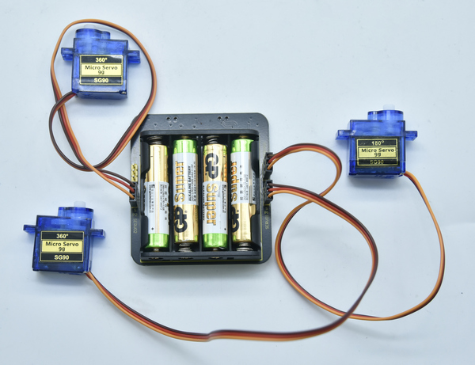

# KS4042 Keyestudio Micro bit Shield For Mini Servo Car V2.0

## Description

This shield is fully compatible with micro bit control board. It  comes with  SK6812-P4 RGB LED and 4 3pin ports with 2.54mm pitch.

Fix battery holder with 2M3*6MM flat screws and 2 M3 nuts, place 4 AAA batteries(not included) inside, and install the micro bit control  board on the mini servo car shield with 5 M3*6MM screws.

When the right DIP switch on the shield is dialed to the ON end,  the battery box supplies power, when dialed to the OFF side, the power  can’t be provided. 

When the left DIP switch is dialed to RGB end, the micro: bit  control board can control the color of 5 SK6812-P4 RGB LEDs by code,  moreover, the 3pins port at the pxl-bxt can connect SK6812-P4 RGB LED  modules and control their colors；when set to SERVO end, micro：bit can  regulate the angles of 3 external servos connected to 3pin ports of  SERVO1 SERVO2 SERVO.

## Parameters

- Working voltage: DC 3.3-5V
- Working current: 600mA(MAX)
- Maximum power: 1.5W(MAX)
- Working temperature: -25 ℃ --65 ℃
- Size: 64 * 56 * 21mm
- Weight: 28.1g
- Environmental attributes: ROHS

## Connection Diagram

## Test Code

## Test Results

After uploading the code successfully, wire the devices well. Set the  right DIP switch to the ON side and the left DIP switch to the RGB side, 5 SK6812-P4 RGB LEDs display alternately the corresponding colors; when the left DIP switch set to the SERVO end, 3 external servos swing from 0 to 90 ° cyclically.

## **Resource**

**Download relevant code:** <https://fs.keyestudio.com/KS0493>

